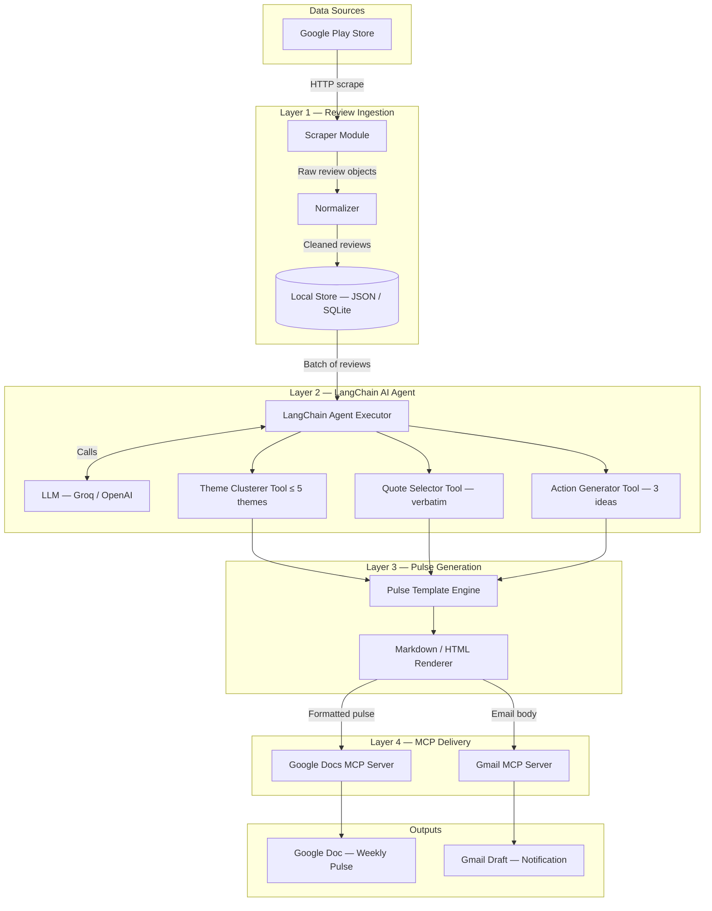
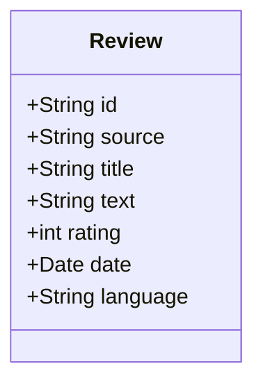
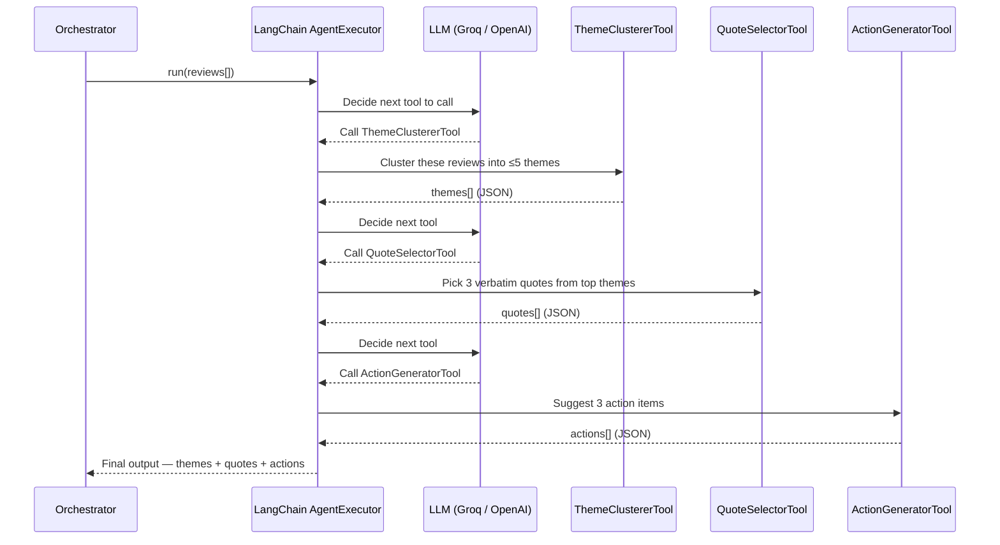
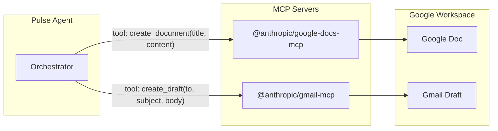
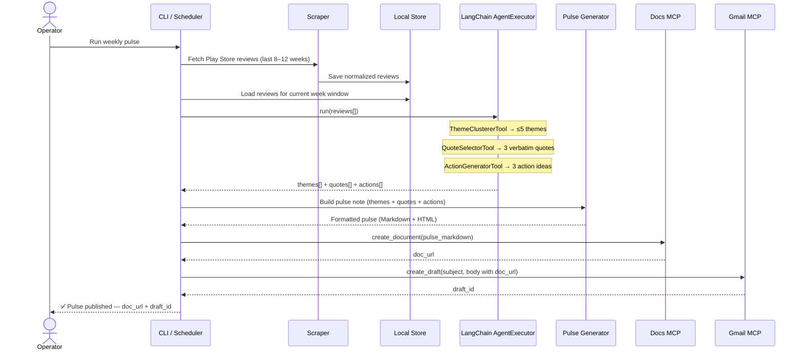

# Architecture — Weekly App Review Pulse via MCP

> System design for scraping **Google Play Store** reviews, clustering them into themes
> using a **LangChain AI agent**, generating a weekly pulse note, and delivering it
> via Google Docs and Gmail using MCP servers.

---

## 1. High-Level System Diagram



---

## 2. Architectural Layers

The system is organized into **four layers**, each with a single responsibility.

### Layer 1 — Review Ingestion

| Component       | Responsibility                                                                                      |
| --------------- | --------------------------------------------------------------------------------------------------- |
| **Scraper**     | Fetches Play Store reviews for `com.nextbillion.groww` covering the last 8–12 weeks                  |
| **Normalizer**  | Maps raw scraped data into a uniform `Review` schema (rating, title, text, date, source)             |
| **Local Store** | Persists normalized reviews locally (JSON file or SQLite) so re-runs don't re-scrape                 |



#### Scraping Strategy — Play Store Only

| Approach                          | Pros                                     | Cons                                   |
| --------------------------------- | ---------------------------------------- | -------------------------------------- |
| `google-play-scraper` (npm)       | Battle-tested, pagination built-in       | Node.js dependency                     |
| `google_play_scraper` (Python)    | Native to Python stack                   | Less maintained                        |
| Custom HTTP + parsing             | No external deps                         | Fragile, must handle pagination        |

> [!TIP]
> **Recommended**: Use `google_play_scraper` (Python) — it integrates cleanly into the Python LangChain stack and returns structured review objects with no HTML parsing required.

---

### Layer 2 — LangChain AI Agent

This is the intelligence layer. A **LangChain Agent** orchestrates three specialized LangChain tools backed by an LLM, processing raw reviews into structured pulse data.

| LangChain Tool         | Input                  | Output                                                   |
| ---------------------- | ---------------------- | -------------------------------------------------------- |
| **ThemeClustererTool** | All reviews (batch)    | ≤ 5 named theme buckets with review assignments          |
| **QuoteSelectorTool**  | Themed reviews         | 3 verbatim user quotes (one per top theme)               |
| **ActionGeneratorTool**| Top 3 themes + quotes  | 3 concrete, actionable improvement ideas                 |

#### LangChain Agent Architecture



> [!IMPORTANT]
> All LangChain Tool outputs must return **structured JSON** to ensure reliable downstream parsing. `QuoteSelectorTool` must explicitly instruct the LLM not to paraphrase — quotes must be **verbatim**.

#### LangChain Tool Implementation Pattern

```python
from langchain.tools import BaseTool
from langchain_core.output_parsers import JsonOutputParser
from pydantic import BaseModel

class ThemeClustererTool(BaseTool):
    name = "ThemeClustererTool"
    description = "Clusters a list of app reviews into at most 5 themes."

    def _run(self, reviews: list[dict]) -> dict:
        # Calls LLM with structured prompt, returns themes[]
        ...

class QuoteSelectorTool(BaseTool):
    name = "QuoteSelectorTool"
    description = "Selects 3 verbatim user quotes from themed reviews."

    def _run(self, themes: list[dict]) -> dict:
        # Returns verbatim quotes — no paraphrasing
        ...

class ActionGeneratorTool(BaseTool):
    name = "ActionGeneratorTool"
    description = "Generates 3 actionable improvement ideas from themes."

    def _run(self, themes: list[dict], quotes: list[str]) -> dict:
        ...
```

#### LangChain Agent Setup

```python
from langchain.agents import AgentExecutor, create_openai_tools_agent
from langchain_groq import ChatGroq
from langchain_core.prompts import ChatPromptTemplate

llm = ChatGroq(model="llama-3.1-70b-versatile", temperature=0.3)
tools = [ThemeClustererTool(), QuoteSelectorTool(), ActionGeneratorTool()]

prompt = ChatPromptTemplate.from_messages([
    ("system", "You are a product analyst. Analyze app reviews step by step."),
    ("human", "{input}"),
    ("placeholder", "{agent_scratchpad}"),
])

agent = create_openai_tools_agent(llm, tools, prompt)
agent_executor = AgentExecutor(agent=agent, tools=tools, verbose=True)
```

#### Prompt Design Principles

1. **System prompt** sets the persona: "You are a product analyst…"
2. **Input** provides the review batch as a serialized JSON array.
3. **Tool schemas** enforce structured output — no free-form text.
4. **Temperature** set to `0.3` for deterministic, analytical outputs.

---

### Layer 3 — Pulse Generation

Transforms structured LLM outputs into a human-readable weekly note.

| Component              | Responsibility                                                        |
| ---------------------- | --------------------------------------------------------------------- |
| **Pulse Template**     | Defines the one-page layout (themes → quotes → actions)               |
| **Renderer**           | Produces both Markdown (for Docs) and HTML (for email body)           |

#### Pulse Note Structure

```
┌──────────────────────────────────────────┐
│         📊 Weekly Review Pulse           │
│         Week of Sep 8 – Sep 14, 2026     │
├──────────────────────────────────────────┤
│                                          │
│  🔥 TOP THEMES                           │
│  1. KYC / Verification Issues            │
│  2. Payment Failures                     │
│  3. App Crashes & Performance            │
│                                          │
├──────────────────────────────────────────┤
│                                          │
│  💬 WHAT USERS ARE SAYING                │
│  • "KYC verification stuck for 3 days…"  │
│  • "Payment failed but money debited…"   │
│  • "App crashes every time I open…"      │
│                                          │
├──────────────────────────────────────────┤
│                                          │
│  🎯 ACTION IDEAS                         │
│  1. Audit KYC queue SLAs and add …       │
│  2. Add retry + auto-refund logic …      │
│  3. Investigate OOM crashes on …         │
│                                          │
└──────────────────────────────────────────┘
```

---

### Layer 4 — MCP Delivery

The delivery layer uses **MCP (Model Context Protocol)** servers to interact with Google Docs and Gmail. No direct Google API client code.



#### MCP Tool Mapping

| Action                          | MCP Server     | Tool Call (example)                                             |
| ------------------------------- | -------------- | --------------------------------------------------------------- |
| Create / update pulse doc       | Google Docs    | `create_document({ title, content })` or `update_document(…)`  |
| Create draft email              | Gmail          | `create_draft({ to, subject, body })`                          |

#### MCP Configuration (`mcp_config.json`)

```json
{
  "mcpServers": {
    "google-docs": {
      "command": "npx",
      "args": ["-y", "@anthropic/google-docs-mcp"],
      "env": {
        "GOOGLE_CLIENT_ID": "${GOOGLE_CLIENT_ID}",
        "GOOGLE_CLIENT_SECRET": "${GOOGLE_CLIENT_SECRET}",
        "GOOGLE_REFRESH_TOKEN": "${GOOGLE_REFRESH_TOKEN}"
      }
    },
    "gmail": {
      "command": "npx",
      "args": ["-y", "@anthropic/gmail-mcp"],
      "env": {
        "GOOGLE_CLIENT_ID": "${GOOGLE_CLIENT_ID}",
        "GOOGLE_CLIENT_SECRET": "${GOOGLE_CLIENT_SECRET}",
        "GOOGLE_REFRESH_TOKEN": "${GOOGLE_REFRESH_TOKEN}"
      }
    }
  }
}
```

> [!NOTE]
> The exact MCP server packages and tool names depend on the MCP ecosystem available at implementation time. The pattern above illustrates the architectural intent — swap in the actual server packages your environment provides.

---

## 3. Data Flow (End-to-End Sequence)



---

## 4. Tech Stack

| Concern              | Technology                                             | Rationale                                              |
| -------------------- | ------------------------------------------------------ | ------------------------------------------------------ |
| **Language**         | Python 3.11+                                           | Rich ecosystem for scraping, LangChain, templating     |
| **AI Agent**         | LangChain (`langchain`, `langchain-core`)              | Agent + tool orchestration over the LLM                |
| **LLM**              | Groq (`openai/gpt-oss-120b`) via `langchain-groq`      | Fast inference; 30 RPM / 8K TPM rate limit tier        |
| **Scraping**         | `google_play_scraper` (Python)                         | Structured Play Store review data; no HTML parsing     |
| **Templating**       | Jinja2                                                 | Clean separation of pulse layout from data             |
| **MCP Client**       | MCP SDK (`@modelcontextprotocol/sdk`)                  | Standard protocol for tool invocation                  |
| **MCP Servers**      | Google Docs MCP, Gmail MCP                             | MCP-first integration — no raw Google API calls        |
| **Storage**          | JSON files (or SQLite for scale)                       | Simple, portable, no infra overhead                    |
| **Config**           | `.env` + `python-dotenv`                               | Secrets management without hardcoding                  |
| **Scheduling**       | `cron` / GitHub Actions / manual                       | Weekly trigger mechanism                               |

---

## 5. Project Directory Structure

```
MCP-server/
├── doc/
│   ├── problemStatement.md          # Problem definition
│   ├── problemstatement.txt         # Original raw problem statement
│   └── architecture.md              # This document
│
├── src/
│   ├── __init__.py
│   │
│   ├── scraper/                     # Layer 1 — Review Ingestion
│   │   ├── __init__.py
│   │   ├── play_store.py            # Play Store scraper (google_play_scraper)
│   │   └── normalizer.py            # Raw → Review schema mapping
│   │
│   ├── agent/                       # Layer 2 — LangChain AI Agent
│   │   ├── __init__.py
│   │   ├── executor.py              # AgentExecutor setup (LangChain)
│   │   ├── tools/
│   │   │   ├── __init__.py
│   │   │   ├── theme_clusterer.py   # ThemeClustererTool (BaseTool)
│   │   │   ├── quote_selector.py    # QuoteSelectorTool (BaseTool)
│   │   │   └── action_generator.py  # ActionGeneratorTool (BaseTool)
│   │   └── prompts.py               # System + user prompt templates
│   │
│   ├── pulse/                       # Layer 3 — Pulse Generation
│   │   ├── __init__.py
│   │   ├── generator.py             # Orchestrates pulse creation
│   │   └── templates/
│   │       ├── pulse.md.j2          # Jinja2 Markdown template
│   │       └── pulse.html.j2        # Jinja2 HTML template (for email)
│   │
│   ├── delivery/                    # Layer 4 — MCP Delivery
│   │   ├── __init__.py
│   │   ├── mcp_docs.py              # Google Docs via MCP
│   │   └── mcp_gmail.py             # Gmail via MCP
│   │
│   └── orchestrator.py              # Main pipeline runner
│
├── data/
│   └── reviews/                     # Cached scraped reviews (JSON)
│       └── .gitkeep
│
├── config/
│   └── mcp_config.json              # MCP server configuration
│
├── tests/
│   ├── test_scraper.py
│   ├── test_analysis.py
│   ├── test_pulse.py
│   └── test_delivery.py
│
├── .env.example                     # Template for secrets
├── .gitignore
├── requirements.txt
├── package.json                     # For MCP server npm deps (if needed)
└── README.md
```

---

## 6. Key Design Decisions

### 6.1 — MCP-First, Not API-First

All Google Workspace interactions go through MCP servers. This means:
- **No OAuth client code** in the application.
- **No REST endpoint wiring** for Docs or Gmail APIs.
- Auth and HTTP plumbing are handled by the MCP server processes.
- The app only makes **tool calls** through the MCP protocol.

### 6.2 — LangChain Agent over Raw LLM Calls

Using a **LangChain AgentExecutor with custom tools** instead of raw sequential LLM calls because:
- **Structured tool contracts** — each `BaseTool` has a typed input/output schema enforced by Pydantic.
- **Composability** — new analysis tools (e.g., sentiment scorer) can be added without rewriting the pipeline.
- **Built-in observability** — `verbose=True` and LangSmith tracing give step-by-step call visibility.
- **Retry / fallback logic** — LangChain handles retries on tool failures with minimal boilerplate.
- **Model flexibility** — swapping from Groq to OpenAI or Anthropic requires only changing the LLM init.

### 6.3 — LLM for Clustering (Not Traditional NLP)

Using an LLM via LangChain tools for theme clustering instead of traditional NLP (e.g., LDA, k-means on embeddings) because:
- Review volume is small (hundreds, not millions).
- LLM produces human-readable theme names directly.
- Same agent call chain handles quotes and action generation.
- No model training or embedding infrastructure needed.

### 6.4 — Structured JSON Output via Tool Schemas

All LangChain Tool outputs enforce Pydantic JSON schemas to ensure:
- Deterministic downstream parsing.
- No hallucinated formatting.
- Easy validation before rendering.

### 6.5 — Local Storage over Database

Reviews are cached as JSON files (one per scrape run). This is sufficient because:
- Weekly data volume is small (a few hundred reviews).
- No concurrent access patterns.
- Easy to inspect, version, and debug.

> [!TIP]
> If the project scales to multiple apps or needs historical analytics, migrate to SQLite or PostgreSQL.

---

## 7. Error Handling & Resilience

| Failure Mode                     | Mitigation                                                     |
| -------------------------------- | -------------------------------------------------------------- |
| Play Store scrape blocked        | Retry with backoff; fall back to cached data                   |
| LLM API rate limit / timeout     | Exponential backoff; configurable retry count                  |
| LLM returns malformed JSON       | Validate against schema; retry with stricter prompt             |
| MCP server connection failure    | Log error; retry once; exit with clear error message            |
| No new reviews in time window    | Skip pulse generation; notify operator via console log          |
| Duplicate reviews across runs    | Deduplicate by review ID before analysis                        |

---

## 8. Configuration & Environment Variables

```bash
# .env.example

# LLM (Groq)
LLM_PROVIDER=groq
LLM_API_KEY=your-groq-api-key
LLM_MODEL=openai/gpt-oss-120b           # 30 RPM, 8K TPM, 1K RPD, 200K TPD

# Groq Rate Limits
GROQ_RPM_LIMIT=30
GROQ_RPD_LIMIT=1000
GROQ_TPM_LIMIT=8000
GROQ_TPD_LIMIT=200000

# Google (used by MCP servers in Phase 5)
GOOGLE_CLIENT_ID=your-client-id
GOOGLE_CLIENT_SECRET=your-client-secret
GOOGLE_REFRESH_TOKEN=your-refresh-token

# App
TARGET_APP_ID=com.nextbillion.groww
REVIEW_WINDOW_WEEKS=8
PULSE_RECIPIENT_EMAIL=your-email@example.com
```

---

## 9. Execution Modes

| Mode           | Trigger                        | Use Case                                     |
| -------------- | ------------------------------ | -------------------------------------------- |
| **Manual**     | `python -m src.orchestrator`   | Dev / testing / one-off runs                  |
| **Cron**       | System crontab (weekly)        | Self-hosted weekly automation                 |
| **CI/CD**      | GitHub Actions scheduled job   | Cloud-based weekly automation                 |

### Example Cron Entry (Every Monday 9 AM)

```cron
0 9 * * 1  cd /path/to/MCP-server && python -m src.orchestrator
```

---

## 10. Security Considerations

| Concern                       | Approach                                                          |
| ----------------------------- | ----------------------------------------------------------------- |
| **API Keys**                  | Stored in `.env`, never committed (`.gitignore`)                  |
| **Google OAuth tokens**       | Managed by MCP servers; app never touches raw tokens               |
| **Review data**               | Public data; no PII beyond usernames visible on the store page     |
| **LLM data transmission**     | Reviews sent to LLM API — ensure provider's data policy is acceptable |

---

## 11. Future Extensions

| Extension                           | Description                                                         |
| ----------------------------------- | ------------------------------------------------------------------- |
| **LangSmith tracing**               | Connect LangSmith for full agent run observability and debugging     |
| **Additional LangChain tools**      | Add SentimentScorerTool, TrendTrackerTool to the agent              |
| **Trend tracking**                  | Store weekly themes and track sentiment over time                    |
| **Slack delivery**                  | Add Slack MCP server for real-time team notifications               |
| **Multi-app support**               | Parameterize app ID to pulse across a product portfolio             |
| **Dashboard UI**                    | Build a web interface to browse historical pulses                   |
| **Apple App Store support**         | Add iOS scraper as a future extension once Play Store flow is stable |
| **Automated scheduling**            | Replace cron with a managed scheduler (Cloud Scheduler, etc.)       |
