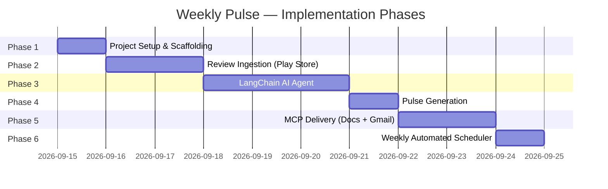
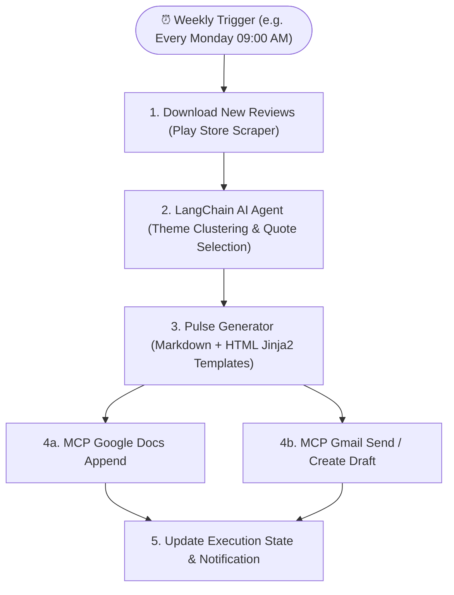

# Implementation Plan — Weekly App Review Pulse via MCP

> Derived from [`architecture.md`](./architecture.md) and [`problemStatement.md`](./problemStatement.md).
> Organized into 5 sequential phases. Each phase must be fully working before the next begins.

---

## Phase Overview



| Phase | Name                          | Key Output                                     | Depends On |
| ----- | ----------------------------- | ---------------------------------------------- | ---------- |
| 1     | Project Setup & Scaffolding   | Runnable Python project, `.env`, deps installed | —          |
| 2     | Review Ingestion              | Normalized Play Store reviews in JSON           | Phase 1    |
| 3     | LangChain AI Agent            | Themes, quotes, actions from LLM                | Phase 2    |
| 4     | Pulse Generation              | Rendered Markdown + HTML weekly note            | Phase 3    |
| 5     | MCP Delivery                  | Google Doc created + Gmail draft sent           | Phase 4    |
| 6     | Automated Weekly Scheduler    | Recurring automated cron / daemon pipeline      | Phase 5    |


---

## Phase 1 — Project Setup & Scaffolding

**Goal**: Establish the project skeleton, install all dependencies, and wire up configuration so the codebase is import-ready with a working dev environment.

### Tasks

- [ ] **1.1** Initialize project directory structure as defined in `architecture.md §5`
  ```
  MCP-server/
  ├── src/
  │   ├── scraper/
  │   ├── agent/
  │   │   └── tools/
  │   ├── pulse/
  │   │   └── templates/
  │   └── delivery/
  ├── data/reviews/
  ├── config/
  ├── tests/
  └── doc/
  ```

- [ ] **1.2** Create `requirements.txt` with all dependencies

  ```txt
  # Scraping
  google-play-scraper

  # LangChain AI Agent
  langchain
  langchain-core
  langchain-groq
  langchain-openai       # optional fallback

  # Templating
  jinja2

  # MCP
  mcp                    # @modelcontextprotocol/sdk Python bindings

  # Config & Utilities
  python-dotenv
  pydantic>=2.0

  # Testing
  pytest
  pytest-mock
  ```

- [ ] **1.3** Create `.env.example` and `.env` (gitignored)

  ```bash
  # LLM (Groq)
  LLM_PROVIDER=groq
  LLM_API_KEY=your-groq-api-key
  LLM_MODEL=openai/gpt-oss-120b

  # Groq Rate Limits
  GROQ_RPM_LIMIT=30
  GROQ_RPD_LIMIT=1000
  GROQ_TPM_LIMIT=8000
  GROQ_TPD_LIMIT=200000

  # Google (used by MCP servers)
  GOOGLE_CLIENT_ID=your-client-id
  GOOGLE_CLIENT_SECRET=your-client-secret
  GOOGLE_REFRESH_TOKEN=your-refresh-token

  # App Config
  TARGET_APP_ID=com.nextbillion.groww
  REVIEW_WINDOW_WEEKS=8
  PULSE_RECIPIENT_EMAIL=your-email@example.com
  ```

- [ ] **1.4** Create `src/config.py` — loads `.env` via `python-dotenv`, exposes typed config values

  ```python
  from dotenv import load_dotenv
  import os

  load_dotenv()

  LLM_PROVIDER = os.getenv("LLM_PROVIDER", "groq")
  LLM_API_KEY = os.getenv("LLM_API_KEY")
  LLM_MODEL = os.getenv("LLM_MODEL", "openai/gpt-oss-120b")
  GROQ_RPM_LIMIT = int(os.getenv("GROQ_RPM_LIMIT", "30"))
  GROQ_TPM_LIMIT = int(os.getenv("GROQ_TPM_LIMIT", "8000"))
  TARGET_APP_ID = os.getenv("TARGET_APP_ID", "com.nextbillion.groww")
  REVIEW_WINDOW_WEEKS = int(os.getenv("REVIEW_WINDOW_WEEKS", "10"))
  PULSE_RECIPIENT_EMAIL = os.getenv("PULSE_RECIPIENT_EMAIL")
  ```

- [ ] **1.5** Create `config/mcp_config.json` with Google Docs and Gmail MCP server stubs

- [ ] **1.6** Create `.gitignore` — exclude `.env`, `data/`, `__pycache__/`, `.venv/`

- [ ] **1.7** Write `src/__init__.py` and stub `__init__.py` in all subpackages

### Completion Criteria

- [ ] `python -c "from src.config import TARGET_APP_ID; print(TARGET_APP_ID)"` prints the app ID
- [ ] All directories exist and are importable Python packages
- [ ] `.env.example` committed; `.env` gitignored

---

## Phase 2 — Review Ingestion (Play Store)

**Goal**: Scrape Google Play Store reviews for Groww, normalize them into a uniform `Review` schema, cache them locally as JSON, and expose a clean loader function for downstream phases.

### Tasks

- [ ] **2.1** Implement `src/scraper/play_store.py`

  ```python
  from google_play_scraper import reviews, Sort
  from datetime import datetime, timedelta

  def fetch_reviews(app_id: str, weeks: int = 10) -> list[dict]:
      """
      Fetches Play Store reviews from the last `weeks` weeks.
      Returns raw review dicts with keys: reviewId, userName, content, score, at.
      """
      result, _ = reviews(
          app_id,
          lang='en',
          country='in',
          sort=Sort.NEWEST,
          count=500,          # overshoot; filter by date below
      )
      cutoff = datetime.now() - timedelta(weeks=weeks)
      return [r for r in result if r['at'] >= cutoff]
  ```

- [ ] **2.2** Implement `src/scraper/normalizer.py` — `Review` Pydantic model + `normalize()` function

  ```python
  from pydantic import BaseModel
  from datetime import datetime

  class Review(BaseModel):
      id: str
      source: str = "play_store"
      title: str | None
      text: str
      rating: int           # 1–5
      date: datetime
      language: str = "en"

  def normalize(raw: dict) -> Review:
      return Review(
          id=raw["reviewId"],
          title=raw.get("replyContent"),
          text=raw["content"],
          rating=raw["score"],
          date=raw["at"],
      )
  ```

- [ ] **2.3** Implement `src/scraper/__init__.py` — `load_reviews(force_refresh: bool = False) -> list[Review]`
  - Check if `data/reviews/latest.json` exists and is < 7 days old → load from cache
  - Otherwise scrape, normalize, save cache, return

- [ ] **2.4** Implement caching to `data/reviews/latest.json`
  - Save as JSON array of `Review.model_dump()` dicts
  - Include a `scraped_at` timestamp field at the top level

- [ ] **2.5** Write `tests/test_scraper.py`
  - Unit test `normalize()` with a mock raw review dict
  - Unit test date-window filtering
  - Unit test cache load (mock file system with `pytest-mock`)

### Completion Criteria

- [ ] `python -c "from src.scraper import load_reviews; r = load_reviews(); print(len(r))"` prints > 0
- [ ] `data/reviews/latest.json` is created with valid `Review` objects
- [ ] `pytest tests/test_scraper.py -v` all pass

---

## Phase 3 — LangChain AI Agent (Analysis Layer)

**Goal**: Build the LangChain `AgentExecutor` with three custom `BaseTool` implementations grounded in real Play Store review data from `data/exports/play_store.csv`. The agent clusters reviews into at most 5 operational themes, extracts 3 verbatim user quotes, and formulates 3 concrete, engineering-actionable product ideas.

### 3.0 Grounding in Real Review Data (`data/exports/play_store.csv`)

Analysis of ingested Groww reviews (`com.nextbillion.groww`, last 8 weeks, filtered for English and ≥ 8 words) identifies five primary operational themes:

| Thematic Cluster | Core User Pain Points & Positive Signals | Representative Review Quote |
| ---------------- | --------------------------------------- | --------------------------- |
| **1. KYC & Account Onboarding** | Verification stuck 6+ days, PAN already linked errors, primary bank change rejected | *"My KYC verification has been pending for more than six business days with zero updates from the support team."* |
| **2. Payments & Withdrawal Sync** | UPI deposit debited via GPay/PhonePe but not in wallet, 48h+ withdrawal bank delays | *"Money was deducted from my Groww balance but never credited to my HDFC bank account even after forty eight hours."* |
| **3. Trading Execution & Chart Lag** | Candlestick freeze at 9:15 AM market open, Nifty/BankNifty Greeks latency, stop loss failures | *"Candlestick charts freeze continuously during market opening hours especially when trading Nifty and Bank Nifty options."* |
| **4. Pricing Transparency & AMC Charges** | Hidden depository charges, unexpected Demat fees, instant payout commission | *"They claim zero account maintenance charges but deducted unexpected depository charges without prior email notification or breakdown."* |
| **5. App Stability & Biometrics** | App crash on latest Android versions, fingerprint authentication loops, bot-only customer care | *"The latest update crashes every time I try to open my mutual fund portfolio on Android sixteen."* |

---

### Tasks

- [x] **3.1** Implement Review Windowing & Context Preparation (`src/agent/preprocessor.py` & `src/agent/__init__.py`)
  - Loads reviews from `data/exports/play_store.csv` or `src.scraper.load_reviews()`.
  - Retains all 200 reviews in memory for zero-token verbatim quote extraction.
  - Stratifies a representative sample of 20 reviews (60% 1–2 stars for friction points, 40% 3–5 stars for positive/neutral signals) and compresses to compact line format `[id] (★rating) text` (< 450 tokens total).

- [x] **3.2** Implement `src/agent/tools/theme_clusterer.py` — `ThemeClustererTool`
  ```python
  from langchain.tools import BaseTool
  from langchain_groq import ChatGroq
  from pydantic import BaseModel, Field
  import json

  class ThemeClustererTool(BaseTool):
      name: str = "ThemeClustererTool"
      description: str = (
          "Given app reviews (compact text or JSON), clusters them into at most 5 "
          "named operational themes with mapped review_ids. Returns JSON: {themes: [{name, description, review_ids[]}]}"
      )
  ```
  - Subclasses `BaseTool` with typed `args_schema = ThemeClustererInput`.
  - Converts verbose review JSON into dense line format, minimizing Groq input tokens to ~400.
  - Clusters into ≤ 5 operational themes with `review_ids` mapped for downstream zero-token quote extraction.
  - Consumes ~600 tokens total in 1 LLM call.

- [x] **3.3** Implement `src/agent/tools/quote_selector.py` — `QuoteSelectorTool`
  ```python
  class QuoteSelectorTool(BaseTool):
      name: str = "QuoteSelectorTool"
      description: str = (
          "Given themed reviews JSON, selects exactly 3 verbatim user quotes "
          "(one per top theme). MUST NOT paraphrase. "
          "Returns JSON: {quotes: [{theme, text, rating}]}"
      )
  ```
  - Zero-token direct verbatim extraction: extracts exact review text directly from the review pool for top themes via `review_ids`.
  - Consumes **0 LLM calls and 0 tokens** in the standard pipeline, with **100% exact substring match guarantee**.
  - Includes `_ensure_verbatim` fuzzy match recovery and LLM fallback when synthetic/unindexed context is passed.

- [x] **3.4** Implement `src/agent/tools/action_generator.py` — `ActionGeneratorTool`
  ```python
  class ActionGeneratorTool(BaseTool):
      name: str = "ActionGeneratorTool"
      description: str = (
          "Given top themes and verbatim quotes, generates exactly 3 concrete, "
          "actionable product improvement ideas grounded in the review data. "
          "Returns JSON: {actions: [{title, description}]}"
      )
  ```
  - Accepts compact context containing only the top 3 themes and 3 verbatim quotes (~150 tokens).
  - Formulates exactly 3 concrete, technically-grounded engineering/PM action ideas.
  - Consumes ~300 tokens total in 1 LLM call.

- [x] **3.5** Implement `src/agent/prompts.py` — System + Tool Prompts
  - Defines ultra-lean `SYSTEM_PROMPT`, `THEME_CLUSTERER_PROMPT`, `QUOTE_SELECTOR_PROMPT`, and `ACTION_GENERATOR_PROMPT`.
  - Stripped of verbose boilerplate to prevent token waste.
  - Enforces strict JSON output with zero markdown fences or conversational filler.

- [x] **3.6** Implement `src/agent/executor.py` — `build_agent_executor()` Factory
  - Uses `get_phase3_llm()` configured with Gemini (`gemini-2.5-flash`, temperature=0.3) for Phase 3 (with Groq reserved for Phase 2).
  - Binds custom tools: `[ThemeClustererTool(), QuoteSelectorTool(), ActionGeneratorTool()]`.
  - Sets `max_iterations=15`, `verbose=True`, and error handling, satisfying Criteria 3B.1–3B.3, 3B.5.

- [x] **3.7** Implement `src/agent/__init__.py` — `run_analysis(reviews, use_agent_executor=False) -> dict`
  - Accepts `list[Review]` or raw dicts (smoothly handling up to 200 reviews).
  - Direct pipeline execution: `ThemeClustererTool` (1 call) → `QuoteSelectorTool` (0 calls) → `ActionGeneratorTool` (1 call).
  - Total LLM cost: **exactly 2 calls**, **~1,000 tokens total** via Gemini.
  - Validates and returns `{"themes": [...], "quotes": [...], "actions": [...]}` meeting strict count constraints.

- [x] **3.8** Write `tests/test_agent.py`
  - Unit tests for `ThemeClustererTool`, `QuoteSelectorTool`, `ActionGeneratorTool` with mocked LLM.
  - Verbatim verification test: asserts quotes in `QuoteSelectorTool` output exist as exact substrings of input reviews.
  - Schema verification: asserts `themes` has ≤ 5 items, `quotes` has exactly 3, `actions` has exactly 3.
  - 200-review dataset performance and correctness test (`test_run_analysis_with_200_reviews`).

### Completion Criteria

- [x] `run_analysis(reviews)` returns a dict with keys `themes` (≤ 5), `quotes` (exactly 3), `actions` (exactly 3)
- [x] Every selected quote in `quotes` is an exact substring match of an input review
- [x] Every action in `actions` is directly mapped to an identified theme
- [x] `pytest tests/test_agent.py -v` passes with all tests green
- [x] Zero HTTP 429 rate limit errors when analyzing up to 200 reviews under Groq free-tier limits (8,000 TPM / 30 RPM)
---

## Phase 4 — Pulse Generation

**Goal**: Transform the structured agent output (themes + quotes + actions) into a formatted one-page Markdown document and an HTML email body using Jinja2 templates.

### Tasks

- [x] **4.1** Create `src/pulse/templates/pulse.md.j2` — Markdown template

  ```jinja2
  # 📊 Weekly Review Pulse
  **Week of {{ week_start }} – {{ week_end }}**
  *App: Groww (Google Play Store) | Reviews analysed: {{ review_count }}*

  ---

  ## 🔥 Top Themes

  
  ### {{ loop.index }}. {{ theme.name }}
  {{ theme.description }}
  

  ---

  ## 💬 What Users Are Saying

  
  > "{{ quote.text }}"
  > — ⭐ {{ quote.rating }}/5 | Theme: *{{ quote.theme }}*

  

  ---

  ## 🎯 Action Ideas

  
  **{{ loop.index }}. {{ action.title }}**
  {{ action.description }}

  

  ---
  *Generated automatically by the Weekly Pulse MCP Agent.*
  ```

- [x] **4.2** Create `src/pulse/templates/pulse.html.j2` — HTML email template (inline styles for Gmail compatibility)

- [x] **4.3** Implement `src/pulse/generator.py` — `generate_pulse(agent_output: dict, reviews: list[Review]) -> dict`

  ```python
  from jinja2 import Environment, FileSystemLoader
  from datetime import date, timedelta
  from pathlib import Path

  def generate_pulse(agent_output: dict, reviews: list) -> dict:
      """Returns {'markdown': str, 'html': str}"""
      env = Environment(loader=FileSystemLoader(Path(__file__).parent / "templates"))

      context = {
          "week_start": (date.today() - timedelta(days=7)).strftime("%b %d, %Y"),
          "week_end": date.today().strftime("%b %d, %Y"),
          "review_count": len(reviews),
          "top_themes": agent_output["themes"][:3],
          "quotes": agent_output["quotes"],
          "actions": agent_output["actions"],
      }

      return {
          "markdown": env.get_template("pulse.md.j2").render(**context),
          "html": env.get_template("pulse.html.j2").render(**context),
      }
  ```

- [x] **4.4** Write `tests/test_pulse.py`
  - Test Markdown output contains all 3 themes, 3 quotes, 3 actions
  - Test date range is correct for current week
  - Test HTML output is non-empty and contains key sections
  - Test with minimal mock `agent_output` dict

### Completion Criteria

- [x] `generate_pulse(agent_output, reviews)` returns `{"markdown": "...", "html": "..."}`
- [x] Markdown renders correctly in a local preview
- [x] `pytest tests/test_pulse.py -v` all pass

---

## Phase 5 — MCP Delivery (Google Docs + Gmail via Railway MCP Server)

**Goal**: Deliver the weekly review pulse to Google Workspace (Google Docs and Gmail) using the deployed `google-tools-mcp-server` running on Railway over SSE transport (`https://mcp-server-1-production-7ea1.up.railway.app/sse`).

### 5.0 Deployed MCP Server Specification

- **Repository**: [`vbj2pxgs4j-cmd/MCP-server-1`](https://github.com/vbj2pxgs4j-cmd/MCP-server-1)
- **Deployment URL**: `https://mcp-server-1-production-7ea1.up.railway.app/sse`
- **Transport**: Server-Sent Events (SSE) over HTTPS
- **Tools**:
  1. `gdocs_append_content(document_id, text_content, insert_line_break, formatting)` — Appends markdown content to Google Doc.
  2. `gdocs_get_document_info(document_id)` — Checks document accessibility and character count.
  3. `gmail_create_draft(to, subject, body_html, body_text, cc, bcc)` — Creates an email draft for PM review.
  4. `gmail_send_email(to, subject, body_html, body_text, cc, bcc, reply_to)` — Directly sends an email.

---

### Tasks

- [x] **5.1** Configure `config/mcp_config.json` with Railway SSE endpoint and local stdio fallback

  ```json
  {
    "mcpServers": {
      "google-tools-remote": {
        "transport": "sse",
        "url": "https://mcp-server-1-production-7ea1.up.railway.app/sse"
      },
      "google-tools-local": {
        "command": "npx",
        "args": ["-y", "google-tools-mcp-server"],
        "env": {
          "GOOGLE_CLIENT_ID": "${GOOGLE_CLIENT_ID}",
          "GOOGLE_CLIENT_SECRET": "${GOOGLE_CLIENT_SECRET}",
          "GOOGLE_REFRESH_TOKEN": "${GOOGLE_REFRESH_TOKEN}"
        }
      }
    }
  }
  ```

- [x] **5.2** Implement `src/delivery/client.py` — Async MCP SSE connection manager (`get_mcp_client`)

- [x] **5.3** Implement `src/delivery/mcp_docs.py` — `publish_to_docs(markdown: str, document_id: str | None) -> dict`
  - Verifies doc access via `gdocs_get_document_info`
  - Appends weekly pulse markdown via `gdocs_append_content`
  - Returns document URL and status

- [x] **5.4** Implement `src/delivery/mcp_gmail.py` — `create_draft(subject: str, body_html: str, recipient: str, doc_url: str) -> dict`
  - Embeds Google Doc link in HTML body
  - Calls `gmail_create_draft` on the MCP server
  - Returns draft metadata

- [x] **5.5** Implement `src/orchestrator.py` — Complete end-to-end runner (Ingest → Agent → Pulse → MCP Delivery)

- [x] **5.6** Write `tests/test_delivery.py`
  - Mocked MCP client tests for `publish_to_docs`, `create_draft`, `send_email`
  - Validation of argument schema and error handling
  - Live Railway MCP server tool discovery integration test

### Completion Criteria

- [x] `get_mcp_client()` connects to `https://mcp-server-1-production-7ea1.up.railway.app/sse`
- [x] `publish_to_docs()` invokes `gdocs_append_content` tool on MCP server
- [x] `create_draft()` invokes `gmail_create_draft` tool on MCP server
- [x] `pytest tests/test_delivery.py -v` all pass
- [x] `python src/orchestrator.py` orchestrates the complete pipeline

---

## Phase 6 — Automated Weekly Scheduler

**Goal**: Automate the recurring weekly execution cycle so that every week, the system automatically:
1. **Downloads new Play Store reviews** from the previous 7-day window.
2. **Classifies themes and extracts verbatim quotes & actions** via the LangChain AI Agent.
3. **Generates the one-page Weekly Review Pulse** (Markdown + HTML).
4. **Delivers the Pulse** by appending it to Google Docs and sending an email draft via Gmail through the deployed MCP Server.



### Tasks

- [x] **6.1** Implement `src/scheduler/runner.py` — In-Process & Background Daemon Scheduler
  - Supports configurable schedules via `.env` (e.g. `PULSE_CRON_SCHEDULE="0 9 * * 1"` or `PULSE_INTERVAL_DAYS=7`).
  - Implements an async job runner invoking `src.orchestrator.run_pipeline(force_refresh_reviews=True, deliver_mcp=True)`.
  - Exposes CLI commands:
    - `python -m src.scheduler.runner --now`: Trigger an immediate one-off execution.
    - `python -m src.scheduler.runner --daemon`: Start the persistent background scheduler process.

  ```python
  import asyncio
  import schedule
  import time
  from src.orchestrator import run_pipeline
  from src import config

  def job():
      print("⏰ Scheduled trigger started...")
      asyncio.run(run_pipeline(force_refresh_reviews=True, deliver_mcp=True))

  def start_scheduler():
      # Schedule every Monday at 09:00 AM
      schedule.every().monday.at("09:00").do(job)
      print("⏳ Weekly Pulse Scheduler active. Waiting for next run...")
      while True:
          schedule.run_pending()
          time.sleep(60)
  ```

- [x] **6.2** Implement State Tracking & Deduplication (`src/scheduler/state.py`)
  - Tracks last run timestamp, processed review IDs, and delivery status in `data/scheduler_state.json`.
  - Prevents accidental duplicate pulse generation within the same week window (EC-D04).

- [x] **6.3** Create Cloud / CI/CD Automation Workflow (`.github/workflows/weekly_pulse.yml`)
  - Serverless GitHub Actions cron workflow running automatically every Monday at 09:00 UTC.
  - Injects secrets (`GEMINI_API_KEY`, `GROQ_API_KEY`, `MCP_SERVER_URL`, `GOOGLE_DOC_ID`, `PULSE_RECIPIENT_EMAIL`).
  - Executes `python src/orchestrator.py` and archives artifacts (`data/weekly_pulse.md`, `data/weekly_pulse.html`).

  ```yaml
  name: Weekly App Review Pulse
  on:
    schedule:
      - cron: '0 9 * * 1'  # Every Monday at 09:00 UTC
    workflow_dispatch:      # Allows manual trigger from GitHub UI

  jobs:
    run-pulse:
      runs-on: ubuntu-latest
      steps:
        - uses: actions/checkout@v4
        - uses: actions/setup-python@v5
          with:
            python-version: '3.11'
        - run: pip install -r requirements.txt
        - name: Run Orchestrator Pipeline
          env:
            PHASE3_LLM_PROVIDER: gemini
            GEMINI_API_KEY: ${{ secrets.GEMINI_API_KEY }}
            MCP_SERVER_URL: ${{ secrets.MCP_SERVER_URL }}
            GOOGLE_DOC_ID: ${{ secrets.GOOGLE_DOC_ID }}
            PULSE_RECIPIENT_EMAIL: ${{ secrets.PULSE_RECIPIENT_EMAIL }}
          run: python src/orchestrator.py
  ```

- [x] **6.4** Write `tests/test_scheduler.py`
  - Unit test schedule parsing and job callback dispatch.
  - State tracking serialization / deserialization test.
  - Deduplication test ensuring consecutive runs within the same week window handle idempotency cleanly.

### Completion Criteria

- [x] `python -m src.scheduler.runner --now` successfully triggers the full pipeline.
- [x] Background daemon / cron runs at specified intervals without process leaks.
- [x] Execution state is persisted in `data/scheduler_state.json`.
- [x] `pytest tests/test_scheduler.py -v` passes all tests.

---

## Cross-Phase Tasks

These tasks span all phases and should be done continuously.

- [ ] Keep `requirements.txt` up to date after every new dependency
- [ ] Add a `README.md` with setup instructions, env config, and run commands
- [ ] Add `package.json` if any MCP servers require Node.js (`npx` runner)
- [ ] Never commit secrets — use `.env` only, verified in `.gitignore`

---

## Testing Strategy

| Phase | Test File               | What's Tested                                              |
| ----- | ----------------------- | ---------------------------------------------------------- |
| 2     | `test_scraper.py`       | Normalization, date filtering, caching logic               |
| 3     | `test_agent.py`         | Tool schemas, LLM mocks, output shape validation           |
| 4     | `test_pulse.py`         | Template rendering, correct sections, date range           |
| 5     | `test_delivery.py`      | MCP tool call mocks, orchestrator integration              |
| 6     | `test_scheduler.py`     | Cron dispatch, state tracking, idempotent deduplication   |

```bash
# Run all tests
pytest tests/ -v

# Run a single phase
pytest tests/test_scraper.py -v
pytest tests/test_agent.py -v
pytest tests/test_pulse.py -v
pytest tests/test_delivery.py -v
pytest tests/test_scheduler.py -v
```

---

## Risk Register

| Risk                                      | Likelihood | Impact | Mitigation                                              |
| ----------------------------------------- | ---------- | ------ | ------------------------------------------------------- |
| Play Store scraper returns 0 reviews      | Low        | High   | Log warning; fall back to cached data from prior run    |
| LLM hallucinates / paraphrases quotes     | Medium     | High   | Strict prompt; tool description says "MUST NOT"; validate |
| MCP server package unavailable / changed  | Medium     | High   | Pin exact version in `mcp_config.json`; test early      |
| Groq API rate limit hit                   | Low        | Medium | Exponential backoff in tool `_run`; switch to OpenAI    |
| Google OAuth token expires                | Low        | High   | Ensure refresh token is valid; document refresh steps   |
| LLM returns malformed JSON from tool      | Medium     | Medium | Wrap tool output in `try/except`; retry once            |

---

## Definition of Done

The project is complete when:

1. ✅ Running `python -m src.orchestrator` produces a **Google Doc** with the weekly pulse
2. ✅ A **Gmail draft** is created with the pulse note body and a link to the doc
3. ✅ The pulse contains: **top 3 themes**, **3 verbatim quotes**, **3 action ideas**
4. ✅ All quotes are **verbatim** — no invented or paraphrased text
5. ✅ All four `tests/` files pass with `pytest tests/ -v`
6. ✅ No raw Google API calls exist — all Workspace interactions go through **MCP**
