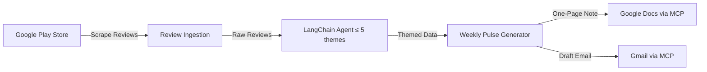

# Problem Statement — Weekly App Review Pulse via MCP

## Goal

Turn raw mobile-store feedback into a **weekly pulse** your team can scan in minutes: what users care about, what they actually said, and what to do next.

Reviews are already public; the job is to **aggregate, theme, summarize, and deliver** that insight through familiar surfaces — **Google Docs** for the written pulse and **Gmail** for a draft you can send yourself — without handling credentials or REST wiring yourself.

> [!NOTE]
> Scope is **Google Play Store only** (App Store / iOS is out of scope for the current version).

---

## End-to-End Flow (What "Done" Looks Like)

1. **Pull recent Play Store reviews** for the product (within the rules below).
   - Target app: [Groww – Google Play Store](https://play.google.com/store/apps/details?id=com.nextbillion.groww&hl=en_IN)
2. **Cluster** reviews into a small set of themes using a **LangChain AI agent** and distill a one-page weekly note.
3. **Publish** that note where stakeholders can read it → **Google Docs**.
4. **Create a draft email** to yourself (or an alias) that contains or links to that pulse → **Gmail**.

---

## Deliverables

The **weekly one-page pulse** must include:

| Section              | Description                                                            |
| -------------------- | ---------------------------------------------------------------------- |
| **Top Themes**       | What people are talking about most                                     |
| **Real User Quotes** | Verbatim snippets from reviews — no invented wording                   |
| **Action Ideas**     | Three concrete next steps grounded in the themes                       |
| **Draft Email**      | A draft email containing the weekly note (or a clear pointer to it)    |

---

## Who This Helps

| Audience             | Why                                                                    |
| -------------------- | ---------------------------------------------------------------------- |
| **Product / Growth** | Prioritize fixes and improvements from real signals                    |
| **Support**          | Align messaging with what users are actually saying                    |
| **Leadership**       | One-page health check without drowning in raw reviews                  |

---

## What You Must Build

1. **Import Reviews**
   - Pull reviews from roughly the **last 8–12 weeks**.
   - Fields such as rating, title, text, date — whatever the export provides.

2. **Theme Clustering**
   - Group reviews into **at most 5 themes**.
   - Example themes: *onboarding, KYC, payments, statements, withdrawals* — pick what fits the product.

3. **Generate Weekly One-Page Note**
   - **Top 3 themes** (subset of overall themes as appropriate).
   - **3 user quotes** (verbatim).
   - **3 action ideas**.

4. **Draft Email**
   - Draft an email with the note to yourself or an alias.

---

## Integrations: Google Docs & Gmail via MCP

Use **MCP (Model Context Protocol)** servers for Google Docs and Gmail — for example, creating or updating the pulse document and creating the draft message — rather than integrating Google APIs directly (no bespoke OAuth client + REST client code as the primary integration path).

MCP servers expose tools your agent or app can call; lean on that pattern so Docs and Gmail stay consistent with the course tooling and avoid duplicating auth and HTTP plumbing.

> [!IMPORTANT]
> Choose MCP servers or connectors your environment provides for Docs and Gmail. The requirement is **MCP-first**, not "call Google APIs manually."

---

## Architecture Overview

---

## Summary

| Aspect            | Detail                                                   |
| ----------------- | -------------------------------------------------------- |
| **Data Source**   | Groww app — Play Store only (last 8–12 weeks)            |
| **AI Framework**  | LangChain agent with custom tools                        |
| **Processing**    | Cluster into ≤ 5 themes, pick top 3 per week             |
| **Output**        | One-page pulse with themes, quotes, and action ideas     |
| **Delivery**      | Google Docs (document) + Gmail (draft email)             |
| **Integration**   | MCP-first (no manual Google API wiring)                  |
